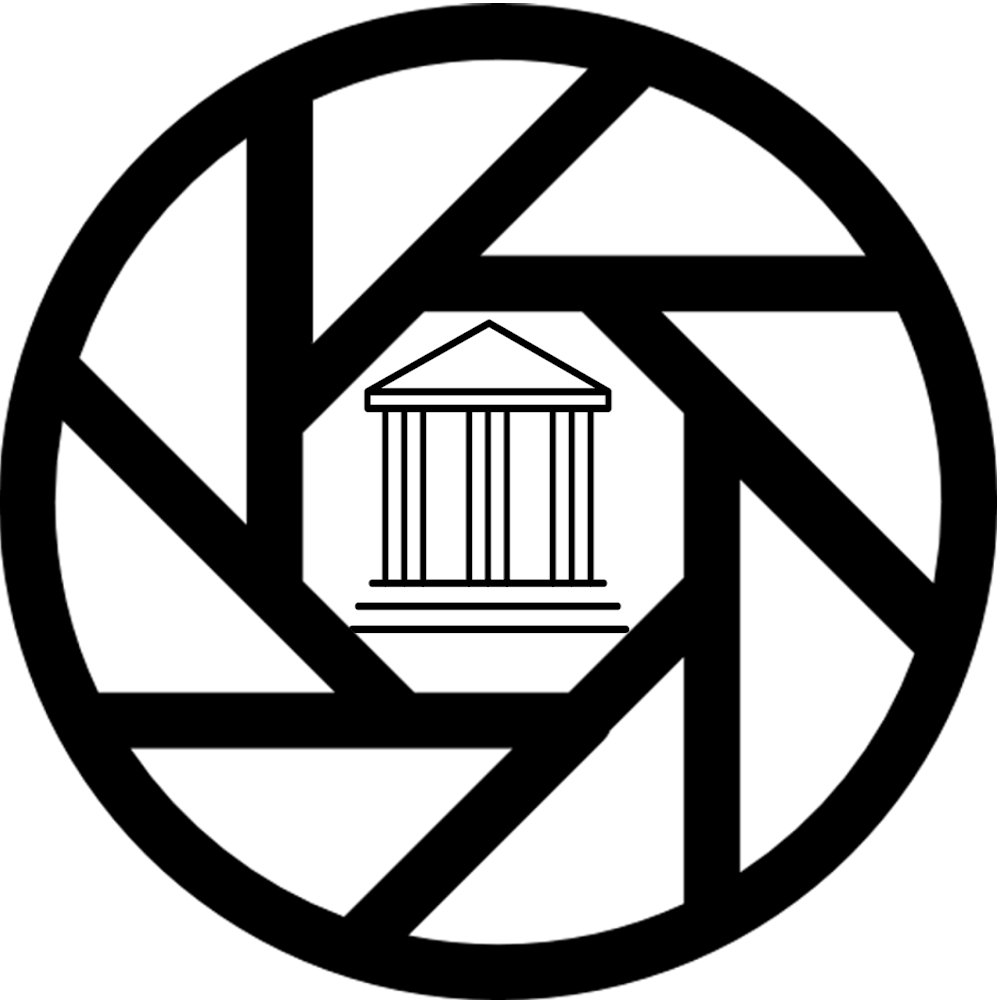

# DIU - Practica 3, entregables

## Landing page
https://github.com/jepalfer/DIU-chiringo/blob/master/P3/LandingPage.pdf

## Moodboard (diseño visual + logotipo)   
Logo -> https://github.com/jepalfer/DIU-chiringo/raw/master/img/photoSpotLogo.png
Moodboard -> https://github.com/jepalfer/DIU-chiringo/blob/master/P3/moodboard.pdf

## Guideline
En esta sección se profundiza más sobre la selección de estilos y diseños que hemos optado.

### Logo 
En una primera instacia diseñamos el siguiente logo:
 

Sin embargo el veredicto final no ha sido satisfactorio tras una vuelta de tuerca en su diseño y lo que se pretendía reflejar con ello,concluimos que el logo no era lo suficientemente acercado a la idea del proyecto y que no reflejaba bien sus motivos.

En una fase final del diseño del logo obtuvimos el siguiente:

Este nuevo logo que le acompaña el nombre del proyecto hace una distinción a modo cómo si fuera una marca respecto con el anterior diseño. Se puede apreciar cómo el objetivo de la aplicación si que se ve más reflejado con el icono de fotografiar y un monumento en su interior.
  
### Paleta de colores
Los colores definidos en el moodboard son:
  - Rojo: `#7c0000` 
  - Negro: `#111111`
  - Gris: `#6D6E70`
  
Los colores utilizados para dar contraste a los anteriores son:
  - Sepia: `#46B58D`
  - Azul: `#46A0E0`
  - Blanco: `#F1F1F1`

  Cabe destacar que todos estos colores podrán ser utilizado variando sus propiedades así cómo la transparencia.

 Para definir los colores ante errores/avisos (warnings) no tengan el mismo color que el rojo y tenga uno más carácterístico hemos decidido por utiizar el amarillo y sus diferente tonalidades que se asocian con la precaución, preocupación que son aptitudes que queremos transmitir ante un mensaje de este tipo.
  Ej: https://static.vecteezy.com/system/resources/previews/012/042/301/original/warning-sign-icon-transparent-background-free-png.png
  
 ### Iconos
 Los iconos que utilizaremos al ser una aplicación de móvil son los de https://ionic.io/ionicons/ además de cumplir con muchos de los problemas de la UX, son open-source.
 
 ### Patrones de diseño
  - Navegación: uso de TABS BAR/pestañas de navegación en la parte inferior de la app, proporciona una facilidad en cuánto a la navegación al igual que indica las principales funciones de la aplicación que ofrece al usuario.
  - Tutorial o guía de uso: uso de STEPPER (patrón que requiere acción del usuario mediante pasos), garantiza que el usuario comprenda el mensaje que nosotros los desarrolladores queremos dar y cómo utilizar la aplicación.
  - Otras secciones: uso de HAMBURGUER MENU (menú deslizable contiene secciones), a veces también se relaciona con 3 puntos ordenados en vertical, es muy útil y usado por la ventaja que ofrece en cuánto a un mayor aprovechamiento del espacio y minimalismo (uno de los principales objetivos en el desarrollo del diseño). 
  - Mapas interactivos: es el pilar de la aplicación para poder cumplir con el cometido de esta, es el motor que guiará al usuario a un spot.
  
  
  Fuentes: -  https://code.tutsplus.com/es/tutorials/android-desde-cero-patrones-de-diseno-ui--cms-26044 <- (TABS, HAMBURGUER MENU(=Bandeja de navegación,Navegación y mapas).
           - https://es.linkedin.com/pulse/asistentes-por-pasos-usabilidad-y-buenas-pr%C3%A1cticas-fern%C3%A1ndez-arnanz <- (Stepper o asistente de pasos).
                                                                                                                    
 ### Tipografía y estilo del lenguaje
 El lenguaje que se aplica a la app debe ser escueto, conciso, simple, formal sin ningún uso de palabras técnicas para que así se haga muy intuitiva y fácil de entender/usar para todo tipo de público.
 En cuánto al estilo de letra:
- Encabezados -> https://www.dafont.com/es/aspergit.font - Aspergit
  - Texto -> https://fonts.adobe.com/fonts/droid-serif - Droid Serif
  
**En caso de que la aplicación del diseño no deje introducir estas letras ideadas y seleccionadas tras un estudio del mismo, se usarán las alternativas que ofreza el entorno del diseño, pero se debe de pensar que no es la tipografía de nuestro producto final.

## Mockup: LAYOUT HI-FI

## Documentación: Publicación del Case Study

(incluye) Valoración del equipo sobre la realización de esta práctica o los problemas surgidos
 
