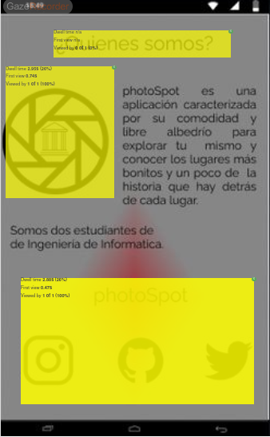
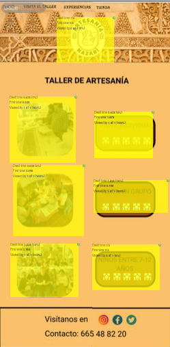

## Practica 5: entregables 

## Experimento
El experimento que hemos considerado es comentarle a los usuarios que miraran a lo que les interesara de photoSpot y de artesanía nazarí
y a partir de ahí hemos obtenido las distintas áreas de interés. Lo hemos realizado utilizando la herramienta "GazeRecorder", un software con versión gratuita
que permite hacer eye tracking, es decir, registra dónde mira el usuario usando la webcam y calibrando previamente la herramienta.

Debido a que en su versión gratuita no permite hacer muchos estudios con una misma cuenta nos hemos visto en la obligación de usar menos usuarios de los que nos 
habría gustado. La persona que ha realizado los experimentos ha sido un amigo de Rubén.

### photoSpot
Para nuestra aplicación hemos obtenido los siguientes mapas de calor y áreas de interés:

### artesanía nazarí
Para esta aplicación hemos obtenido los siguientes mapas de calor realizando el mismo experimento:

### CONCLUSIONES
Podemos ver que la herramienta para eye tracking nos proporciona una aproximación de dónde ha estado mirando el usuario y crea además de un mapa de calor siendo
la zona roja el lugar más visualizado y la zona azul-morada la que menos. Además presenta una pestaña de 'Analytics' donde se generan también unos rectángulos amarillos
que representan las áreas de interés, aunque es una aproximación y no representa al 100% dónde ha mirado el usuario según el heat map.

Observamos que en ambas aplicaciones son las imágenes y logos, seguidos por el texto que haya.
